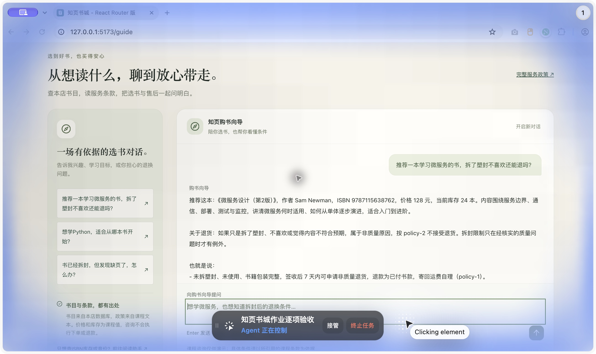
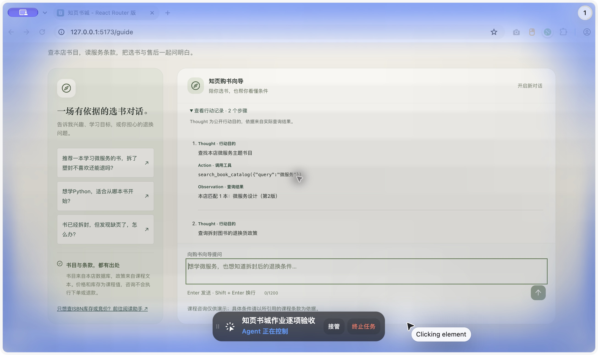
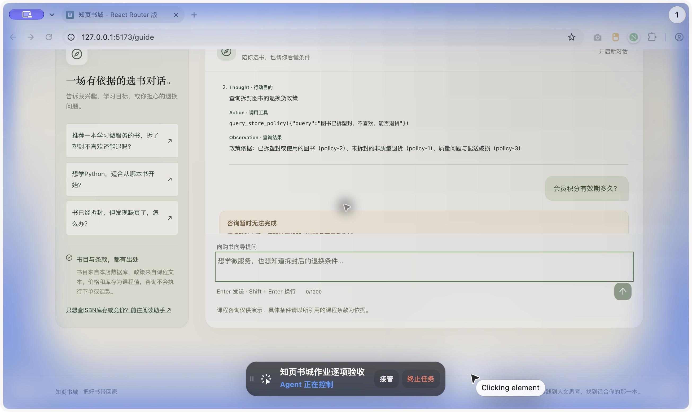

# 作业3 · 真实复杂案例

524031910745 丁宇轩

验收时间：2026-10-05T22:37:21.337Z。模型：deepseek-flash。本案例为真实DeepSeek、MySQL书目与本地中文Embedding调用。

## 用户问题

推荐一本学习微服务的书，拆了塑封不喜欢还能退吗？

## 完整公开行动链

以下Thought为模型给出的一句公开行动目的；没有记录或展示隐藏思考。Action参数与Observation完整保留实际返回内容。

### 第1步

Thought：查找本店微服务主题书目

Action：`search_book_catalog`

```json

{
  "query": "微服务",
  "purpose": "查找本店微服务主题书目"
}

```

Observation：

```json

{
  "ok": true,
  "query": "微服务",
  "hasMatches": true,
  "source": "本店课程MySQL书目",
  "message": "以下为本店当前匹配书目，价格库存均为课程演示值",
  "books": [
    {
      "id": "building-microservices",
      "title": "微服务设计（第2版）",
      "author": "Sam Newman",
      "isbn": "9787115638762",
      "summary": "围绕服务边界、通信、部署、测试与监控，理解微服务何时适用，以及如何从单体系统逐步演进。",
      "price": 128,
      "stock": 24
    }
  ]
}

```

### 第2步

Thought：查询拆封图书的退换货政策

Action：`query_store_policy`

```json

{
  "query": "图书已拆塑封，不喜欢，能否退货",
  "purpose": "查询拆封图书的退换货政策"
}

```

Observation：

```json

{
  "ok": true,
  "query": "图书已拆塑封，不喜欢，能否退货",
  "matched": true,
  "chunks": [
    {
      "id": "policy-2",
      "title": "已拆塑封或使用的图书",
      "text": "已拆塑封、已阅读或有个人标记的纸质图书，如仅因不喜欢、内容不符合预期或买错版本，不接受非质量原因退货。拆封限制不适用于经核实的质量问题；遇到缺页、倒页、明显印刷错误或配送破损，应按质量问题条款申请处理，不能仅因拆封而拒绝。",
      "source": "store-policy.txt",
      "version": "course-2026-10-06",
      "score": 0.8169780428299405
    },
    {
      "id": "policy-1",
      "title": "未拆封的非质量退货",
      "text": "签收后7天内，纸质图书未拆塑封、未使用，书籍及包装完整、无污损，并有本店订单凭证，可以申请非质量原因退货。退款范围为已支付的图书价款，非质量退货的寄回运费由读者承担。超过7天的非质量退货不受理。",
      "source": "store-policy.txt",
      "version": "course-2026-10-06",
      "score": 0.773793020985715
    },
    {
      "id": "policy-3",
      "title": "质量问题与配送破损",
      "text": "签收后15天内发现缺页、倒页、明显印刷错误或配送破损，可凭订单和清晰照片申请换货或退货。经核实属于质量或配送问题，拆过塑封也可处理，寄回运费由本店承担。库存不足无法换货时，可选择退还已支付的图书价款。超出期限的情况需人工核实，不自动承诺退换。",
      "source": "store-policy.txt",
      "version": "course-2026-10-06",
      "score": 0.6627904049187596
    }
  ],
  "status": "ready",
  "model": "Xenova/bge-small-zh-v1.5",
  "revision": "75c43b069aac4d136ba6bc1122f995fedcfd2781",
  "dimension": 512,
  "sourceHash": "4979c91639b417091f3f72ad8400302919d0e09b4af7964afeae61b81c760f28",
  "chunkCount": 6,
  "cacheHit": true,
  "threshold": 0.62,
  "simulatedPolicy": true,
  "message": "以下为检索到的课程政策原文，请结合条件阅读。"
}

```

## 最终真实答复

推荐这本：《微服务设计（第2版）》，作者 Sam Newman，ISBN 9787115638762，本店价格 128 元，库存 24 册。它围绕服务边界、通信、部署、测试与监控，讲清微服务何时适用、如何从单体逐步演进，适合入门到进阶。

关于退货：拆了塑封、仅因不喜欢，是不能退的。依据 policy-2，已拆塑封、已阅读或有个人标记的纸质图书，若只是不喜欢、内容不符合预期或买错版本，不接受非质量原因退货。另外按 policy-1，未拆封的非质量退货需在签收后 7 天内、书籍包装完整并有订单凭证，寄回运费由读者承担，超期不受理。

不过有个例外：如果经核实是质量问题（缺页、倒页、明显印刷错误）或配送破损，按 policy-3，签收后 15 天内可凭订单和清晰照片申请换货或退货，拆过塑封也能处理，寄回运费由本店承担；库存不足无法换货时可退还书款。

所以建议你先确认是否属于质量问题。若只是内容不合口味，拆封后无法退。价格与库存为课程演示数据，会员积分与退款功能尚未实现，具体办理请联系人工客服。

## 依据与核对

推荐来自本店building-microservices，ISBN9787115638762；库存24本、售价128元为验收当时课程数据。实际政策同时包含未拆封条件、已拆封非质量退货限制和质量问题例外，模型引用实际policy-N，不将非质量限制扩大到质量缺页。查询前后全量书目未变化。

真实模型响应标识：

- `7abbf63a-6eeb-4ccb-b62b-82b6990dbc2f`
- `3501e595-a485-4f6c-8b58-e47f8c5e2785`
- `ddaef22a-39e4-4be7-bf4b-278a279f983f`

完整原始记录：evidence/3b-real-model.json。政策全文：backend/src/main/resources/store-policy.txt。

## 桌面展示

以下截图为桌面端对同一问题的另一次真实调用，展示回复、书目与政策行动记录；不把这次截图强行视作上面API响应。







## 验收边界

政策是课程模拟文本，模型与Embedding调用是真实的。本次未执行下单、退款或会员积分抵扣；未检测手机比例。模型并不总给出相同措辞，应核对实际工具依据与质量问题例外。
